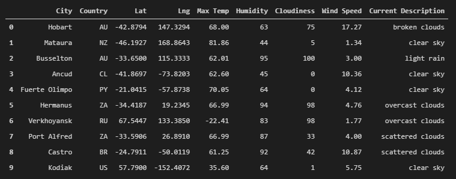
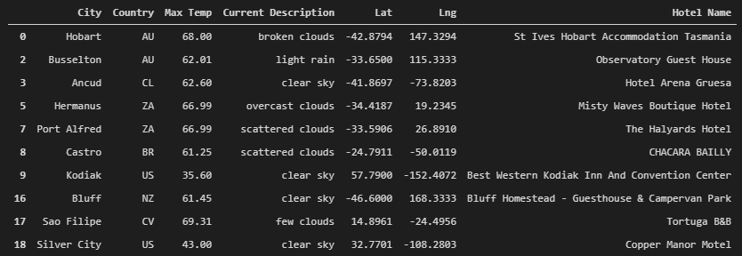
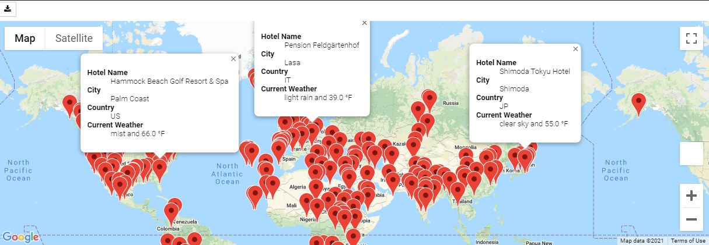
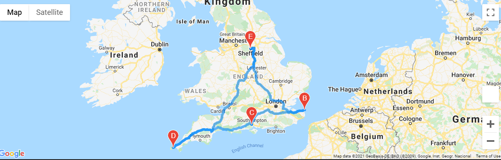
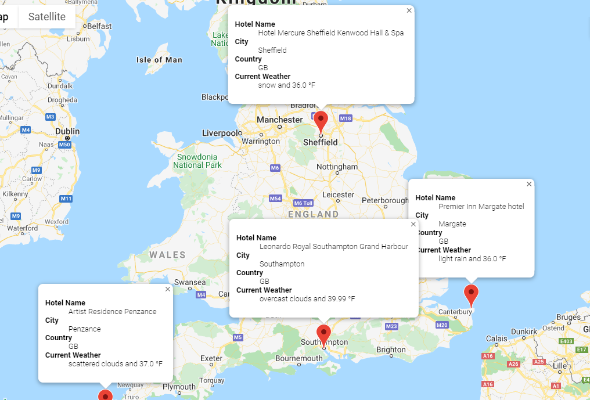

# World Weather Analysis

## Project Overview

I am working at PlanMyTrip, a top travel-technology company which specializes in internet related services in hotel and lodging industry. Jack, head of Analysis for User Interface has asked me to help him create an app to provide real-time suggestions to our customers to find ideal hotels based on their weather preferences.

Jack and beta testers loved the PlanMyTrip app but they had a couple of suggestions. 
1. Add Weather Description to the weather data we retrieved earlier from OpenWeatherMap API.
2. Create travel route map and marker layer map using Google Maps Directions API for 4 cities chosen by beta testers for their travel itinerary.

## Project Deliverables

### Deliverable 1
* Generated a set of 2000 latitudes and longitudes 
* Retrieved the nearest cities to those sets of latitudes and longitudes by using `citipy` module
* Performed API call with OpenWeatherMap to retrieve: 
    * Maximum temperature
    * Percent humidity
    * Percent cloudiness
    * Wind speed
    * Weather description
* Stored the above mentioned weather data in a CSV file `WeatherPy_Database.csv`

**Snapshot of DataFrame exported to WeatherPy_Database.csv:**

### Deliverable 2

* Imported the data from `WeatherPy_Database.csv` created in deliverable 1 
* Let customers choose Minimum and Maximum temperature range
* Filtered data to select the cities which have Max Temp falling inside the temperature range
* Include the name of nearest hotel in data using Google Maps API
* The resulting dataframe have following info: City, Country, Max Temp, Current Description, Lat, Lng, Hotel Name
* Stored the output in CSV file `WeatherPy_vacation.csv`
* Created marker layer map that have pop-up markers for each city on the map showing Hotel Name, City, Country, and Current Weather (combination of Current Description and Max Temp)

**Snapshot of DataFrame exported to WeatherPy_vacation.csv:**

**Marker Layer Map With Pop-up Markers:**

### Deliverable 3
* Imported the data from `WeatherPy_vacation.csv` created in deliverable 2
* Selected four cities from the data that customers might want to visit
* Created a directions layer map using Google Maps Directions API between the 4 cities. The starting city is also be chosen as the ending city
* Created marker layer map with a pop-up marker for each city in the itinerary

**Directions Layer Map For 4 Cities:**

**Marker Layer Map For 4 Cities:**
